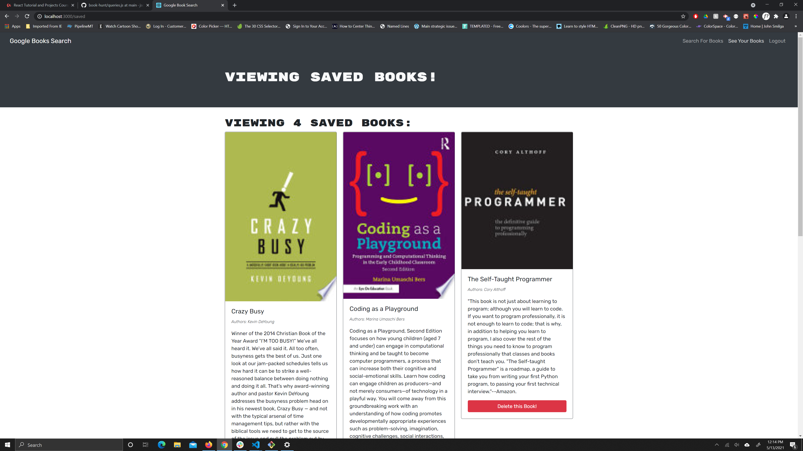

# Book Search Engine 

## Description
fully functioning Google Books API search engine built with a RESTful API, and refactor it to be a GraphQL API built with Apollo Server. The app was built using the MERN stack, with a React front end, MongoDB database, and Node.js/Express.js server and API
    
  ## Installation
  * You have to clone the repository on to your local machine. From the root directory run `npm install or npm i`
    
  ## Usage
  

  You can interact with application by clinking on this link [https://youtu.be/6JQF7C3CFa8](https://youtu.be/6JQF7C3CFa8)
 
  ## Questions
  If you have any questions or comment about this repository, you can reach me at [e.kankam95@hotmail.com](mailto:e.kankam95@hotmail.com).
  Feel free to view more of my work on GitHub at [kwabena95](https://github.com/kwabena95)
